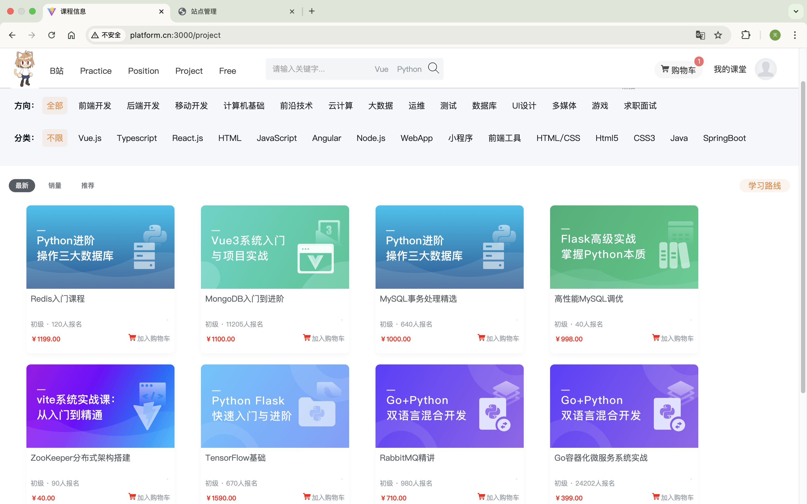
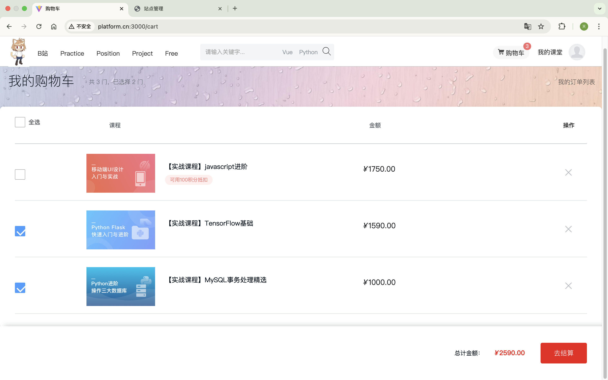
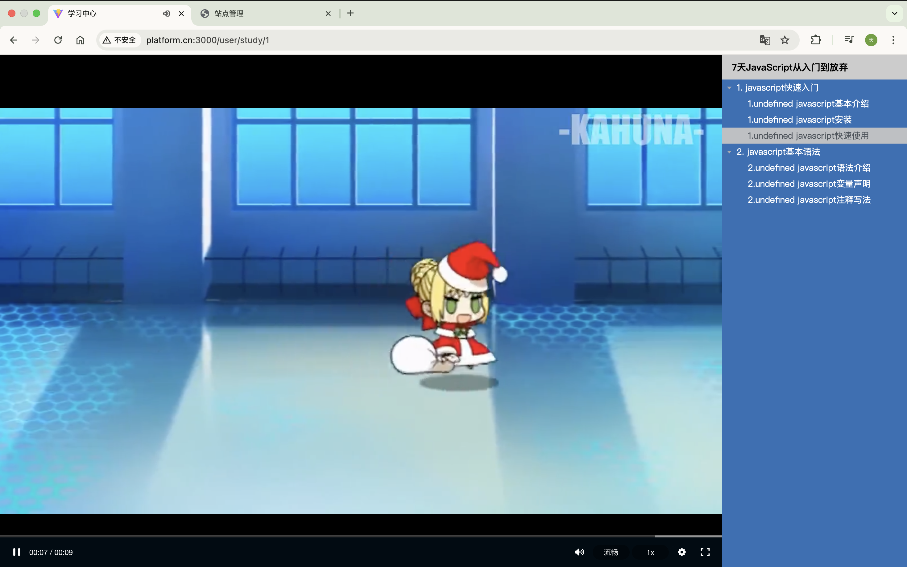
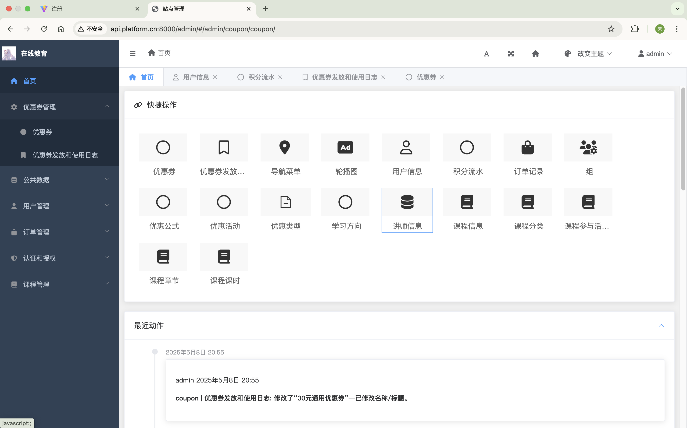

#### 学习了企业级项目开发，并制作了一个虚拟商品电商平台。  
使用阿里云的云存储服务，将页面展示的视频、用户头像等上传到云端并读取展示；使用腾讯云的验证码进行人际验证；使用容联云短信配置，并使用celery进行异步向注册用户手机号发送短信验证；使用保利威进行视频存储与加密播放。  还添加了支付宝支付功能，也用了celery进行异步判断订单是否超时。
## 配置
### 相关配置信息参考技术开发文档  
---
# 预览：  
### 首页：

### 商品浏览

### 购物车

### 视频播放

### 后台管理

## 等等......